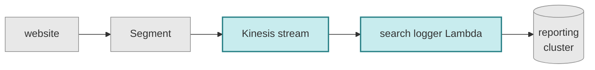

# search-logger

This is a tool which logs user searches to our "reporting" Elasticsearch cluster.
These logs include:

*   what search term somebody typed in
*   how many results we returned
*   which results (if any) that they clicked on.

We use this to analyse search behaviour and improve our queries.
For example, we can look at searches that return 0 results and discuss whether there really are no results, or whether we should change the results we return.

## How search events get logged



Our website [sends tracking events][track.ts] to [Segment].
Those segments are forwarded to a [Kinesis data stream][kinesis], which triggers a Lambda function.
That Lambda function writes the search logs into the [reporting cluster].

This repo contains:

*   the source code for the Lambda function
*   the Terraform definitions for the Kinesis stream and the Lambda function

[track.ts]: https://github.com/wellcomecollection/wellcomecollection.org/blob/9115873707b411a1ecfe2a93f5ebf7f240861c8f/common/services/conversion/track.ts#L6
[Segment]: https://segment.com/
[kinesis]: https://segment.com/docs/destinations/amazon-kinesis/
[reporting cluster]: https://reporting.wellcomecollection.org

## Developer info

*   To deploy a new version the function:

    ```console
    $ cd lambda
    $ yarn deploy
    $ cd ../terraform
    $ ./run_terraform.sh apply
    ```

*   You can see the Lambda logs <a href="https://logging.wellcomecollection.org/app/discover#/?_g=(filters:!(),refreshInterval:(pause:!t,value:0),time:(from:now-15m,to:now))&_a=(columns:!(log),filters:!(('$state':(store:appState),meta:(alias:!n,disabled:!f,index:cb5ba262-ec15-46e3-a4c5-5668d65fe21f,key:service,negate:!f,params:(query:%2Faws%2Flambda%2Fsearch_logger_kinesis_to_es_lambda),type:phrase),query:(match_phrase:(service:%2Faws%2Flambda%2Fsearch_logger_kinesis_to_es_lambda)))),index:cb5ba262-ec15-46e3-a4c5-5668d65fe21f,interval:auto,query:(language:kuery,query:''),sort:!(!('@timestamp',desc)))">in the logging cluster</a>.
